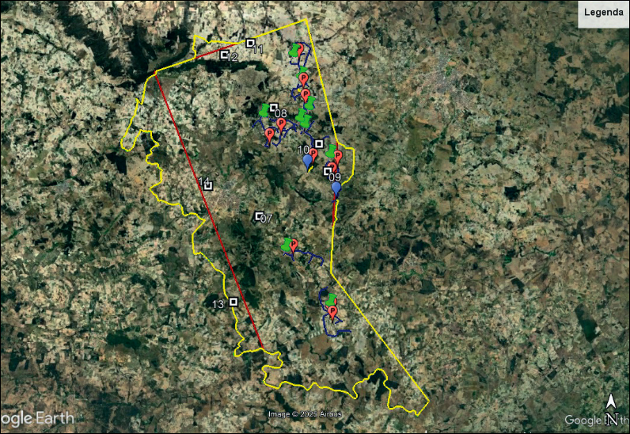
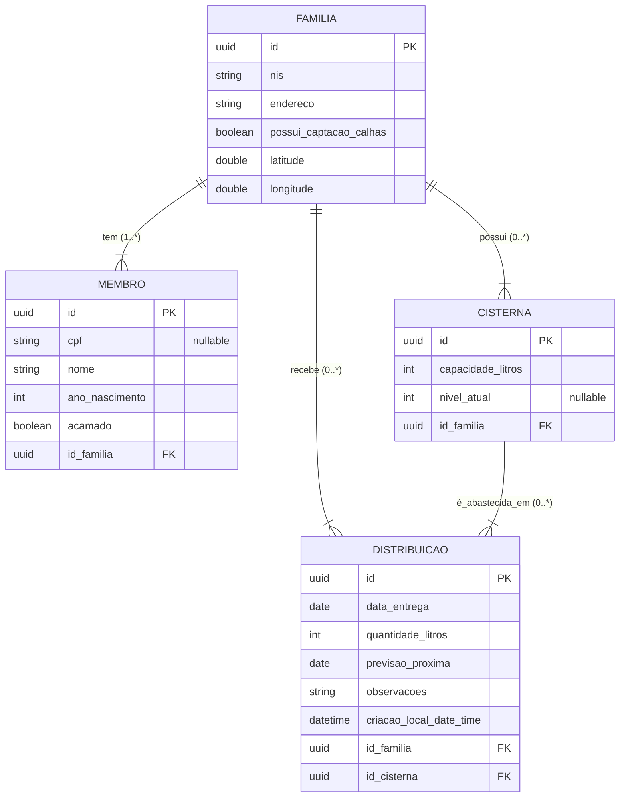

# Treinamento-Em-Memoria-Rust-Mais-Agua-Nosso-Povo
Repositorio focado no treinamendo sobre a linguagem rust no formato de uma resolução para um desafio utilizando salvamento em memoria.

---

## Público alvo:
O público-alvo é em sua maioria constituída por agricultores familiares do município de Jupi/PE, logo todos são moradores da rural do referido município. 

## Solução esperada:
Através do sistema, esperamos que ao considerar o número de pessoas de cada núcleo familiar haja uma distribuição igualitária, logo, o sistema deverá calcular o número de pessoas residentes na casa x a quantidade de água suficiente para o consumo daquela casa. Após isso, o sistema deverá considerar a capacidade em litros de cada cisterna daquele núcelo familiar. Logo, saberemos com base na capacidade uma previsão de quando será necessário enviar água. 

É de fundamental importância que o sistema contenha as datas em que cada família recebeu água, uma previsão do novo fornecimento, dados de cada família (nome, idade, se há algum membro familiar acamado) e informações no sistema se o núcleo familiar tem sistema de captação de água por calhas. 

---

## Informações complementares:
A Secretaria Municipal de Agricultura, Meio Ambiente e
Desenvolvimento Econômico de Jupi/PE tem feito um georreferenciamento das cisternas da zona rural, atrelado a isto, temos feito um recadastramento com todos os beneficiários que recebem água da zona rural. A ação tem como finalidade criar um banco de dados na secretaria contendo: nome, coordenada
geográfica de cada cisterna e capacidade de cada uma delas em litros, quantidade de moradores por residência, ausência ou presença de calhas, presença de pessoas acamadas, entre outras informações.

O intuito é planejar de modo mais eficiente a distribuição de água
considerando o consumo de cada núcleo familiar e obtendo informações sobre
os envios de água e a previsão de novas remessas, em resumo.

### [Link-do-desafio](https://desafios.pe.gov.br/challenge?url=mais-agua-para-nosso-povo-1)

---

## Modelagem do banco

---
